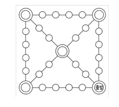

# 웇놀이 기능 명세서

## 1. 윷놀이 게임 기초세팅
- [x] 참여자의 명수를 입력받는다
    - [x] 참여자는 최소 2명에서 4명까지 가능하다
    - [x] 그 밖의 범위를 입력하면 예외가 발생한다
- [x] 게임 말의 개수를 입력받는다
    - [x] 게임 말은 최소 2개, 최대 5개까지 가능하다
    - [x] 그 밖의 범위를 입력하면 예외가 발생한다
- [x] 윷놀이 판 커스터마이즈를 할 수 있다
    - [x] 윷놀이 판의 최소 다각형은 사각형이다
    - [x] 오각형, 육각형 윷놀이를 지원한다.

## 2. 윷놀이 게임 진행

### 2-1. 윷 던지기
- [x] 윷을 던질 수 있다
    - [x] `랜덤 윷 던지기` : 랜덤한 윷의 결과가 나타난다.
    - [x] `지정 윷 던지기` : 빽도, 도, 개, 걸, 윷, 모 중 선택한 결과로 진행
- [x] 상대 말을 잡으면 윷을 한번 더 던진다
- [ x 윷이나 모가 나오면 한번 다시 던질 수 있다

### 2-2. 말 이동하기
- [x] 이동할 말을 선택한다
- [x] 말을 이동한다
    - 
    - [x] 원에서 출발할 떄 : 한 곳을 선택지로 제공한다
    - [x] 코너노드
      - [x] 코너노드에서 출발할 때
        - [x] 중앙으로 꺾는 루트가 빠르면, 중앙 노드로 진행한다
        - [x] 직진 루트가 빠르면, 직진한다 ex) 좌하단 코너
      - [x] 코너노드를 지나치는 경우, 테두리를 따라 돌아간다.
    - [x] 중앙 원에서의 행마 룰
      - [x] 사각형 보드일 때
        - [x] 만약 중앙에 위치했다면 가장 빠른 루트로 진행한다.
        - x 중앙노드가 아닌 곳에서 시작하여 중앙노드를 지나쳐간다면, 직진한다
      - [x] 오각형, 육각형 보드일 때
        - [x] 만약 중앙에서 출발한다면 가장 빠른 루트로 진행한다
        - [x] 만약 중앙이 아닌 곳에서 출발하여, 지나치는 구조라면, 두번째로 빠른 루트로 진행한다.
    - [x] 정해진 이동 횟수 내에 도착지에 도착할 수 있을 때 : 도착으로 취급한다

### 2-3. 말 잡기
- [x] 이동한 곳에 상대방 말이 있다면 상대말을 무조건 잡는다
    - [x] 잡은 말을 1개 단위의 말로 나뉘어져 시작 지점으로 돌아간다. ex. 2개 업은 말을 잡았다면 1개말로 나뉘어짐
    - [x] 상대말을 잡았다면 윷을 한번 더 던질 수 있다.
    - [x] 첫번째 노드에서 빽도가 나오면 마지막 노드 말을 잡을 수 있다

### 2-4. 말 업기
- [x] 이동한 곳에 자신의 말이 있다면 말을 업는다.
    - [x] 업혀진 말은 하나의 게임말 단위로 취급하며 업힌 순간부터 같이 이동한다

### 2-5. 빽도 룰
- 
- [x] 아직 보드에 말이 올라와있지 않다면(start), 빽도를 무효화한다.
- [x] 시작 노드(S0)에서 빽도가 나오면, 마지막 노드로 되돌아간다.
- [x] 마지막 노드(S5)에서 빽도가 나오면
    - [x] 마지막 노드까지 온 기록이 있다면, 이동한 루트를 기억하여 되돌아간다.
    - [x] 연속 빽도 시작노드(S0) 로부터 온 상황이면 테두리 일반 노드를 따라 이동한다.
- [x] 원(일반 노드)의 경우, 바로 이전 노드로 이동한다
- [x] 쌍원(코너 노드)에서 빽도가 나왔을 때
    - [x] 이동한 기록이 있다면, 이동한 루트를 기억하여 되돌아간다.
    - [x] 이동한 기록이 없다면 (시작하자마자 빽도가 5번 연속 나와, 코너노드로 돌아갈 경우), 테두리 일반노드를 따라 이동한다
- [x] 중앙 노드에서 빽도가 나왔을 때
    - [x] 이동한 기록을 따라 루트를 기억하여 되돌아간다.

## 3. 윷놀이 게임 종료
- [x] 자신 팀의 모든 말을 내보는 팀이 승리한다
- [ ] 게임 종료 시, 승리 팀을 표시한다
- [x] 재시작 혹은 종료를 선택할 수 있다
