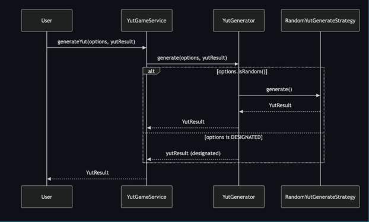
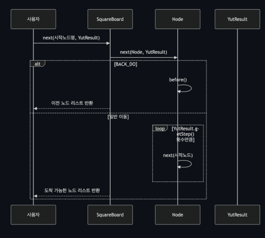
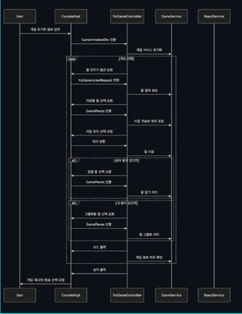
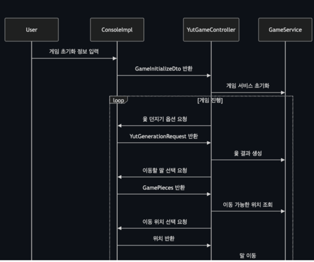
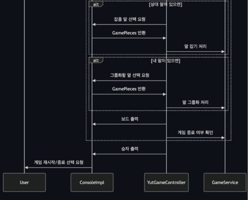

# 1. 윷 던지기 로직

- 유저가 윷 옵션(지정, 랜덤) + 결과를 선택
- YutGenerator가 던지기 전략 선택
- 윷 결과 전달

# 2. 보드 행마 로직

- next(시작노드명, 윷 결과) 전달
- Node에게 next 전달 메서드 호출
- 백도 : 이전 노드 반환
- 일반 이동 : YutResult 횟수만큼 next로 나온 노드 호출
- 도착 가능한 노드 반환

# 3. 윷놀이 게임로직

- 게임 시작 호출
- 우승팀이 나올 때까지 반복
- 윷 던지기 요청
- 이동할 말 선택
- 이동할 위치에 상대 말이 있으면 -> 말잡기
- 이동할 위치에 나의 말이 있으면 -> 말 업기
- 게임 종료 및 재시작 여부 입력

## 3-1. 윷 던지기 요청

- 이동할 말 선택 -> 이동할 위치 조회
- 이동 위치 선택 요청

## 3-2. 말 이동

- 상대 말이 있으면 -> 말 잡기
- 나의 말이 있으면 -> 말 업기
- 승자 출력
- 게임 재시작/선택 요청
